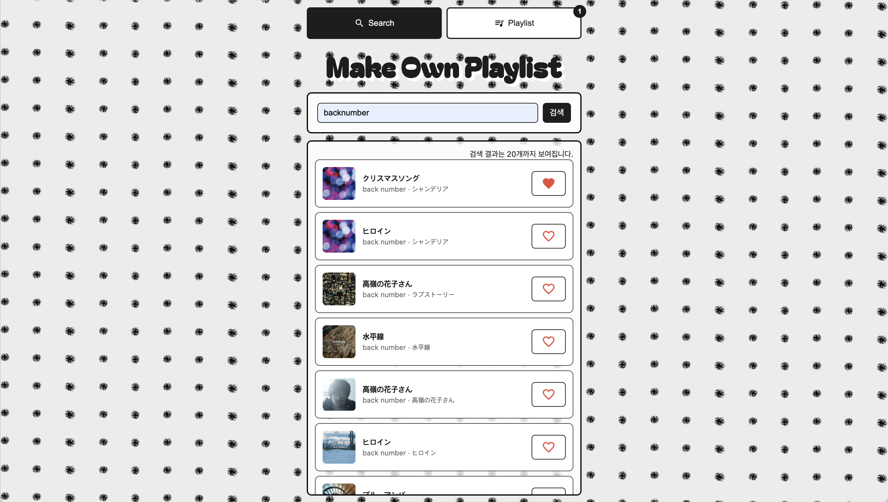

# 🚀 Make Own Playlist

> 상업적 의도가 없는 개인 음악 검색 및 플레이리스트 생성 웹사이트



## ✨ 주요 기능

- 음악 검색
- 플레이리스트 생성 및 공유

## 🛠️ 기술 스택

- **Frontend:** `React`, `CSS`, `JavaScript`
- **Backend:** `Node.js`

## ⚙️ 설치 방법

프로젝트를 로컬 환경에서 실행하려면 아래 단계를 따르세요.

**1. 사전 요구사항**

- Node.js 18 이상

**2. 설치 과정**

```bash
# 1. 저장소 복제
git clone [https://github.com/twothreezero/own-playlist.git](https://github.com/twothreezero/own-playlist)
cd your-project

# 2. 프론트엔드 설정
npm install

# 3. 백엔드 설정
npm install
```

## 🕹️ 사용법

프로젝트를 설치한 후, 아래 명령어를 실행하여 서버를 시작할 수 있습니다.

```bash
# 서버 실행
npm rud dev
```

이후 브라우저에서 http://localhost:4000으로 접속하세요.

## 📧 연락처

[twothreezero]

GitHub: @realtwothreezero

Email: realtwothreezero@gmail.com
